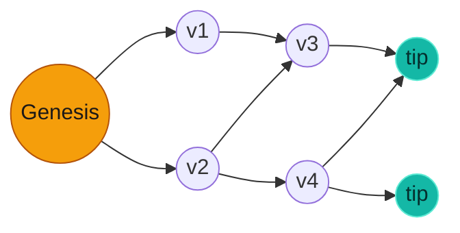
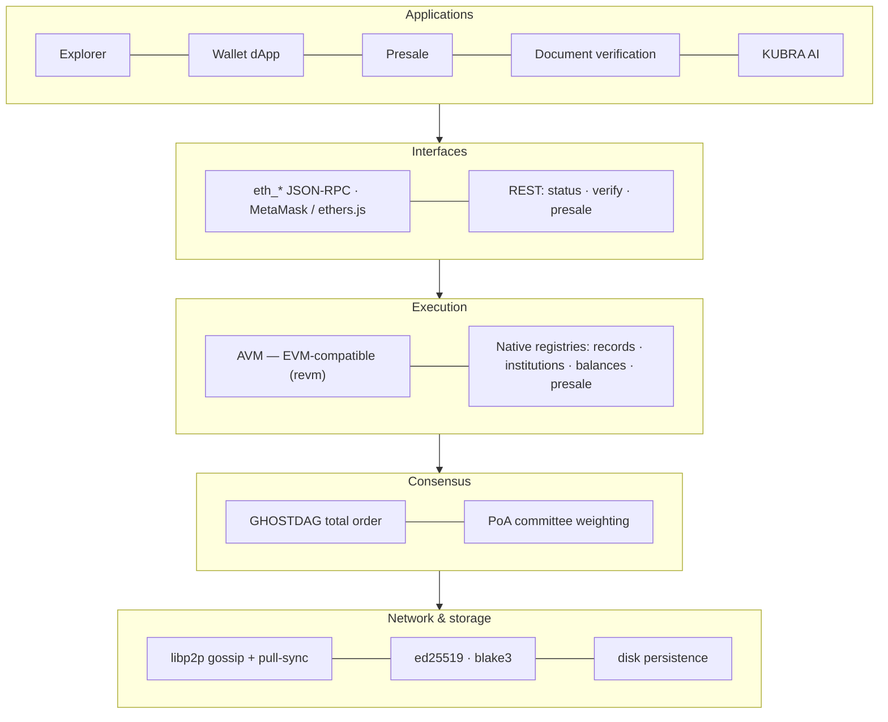
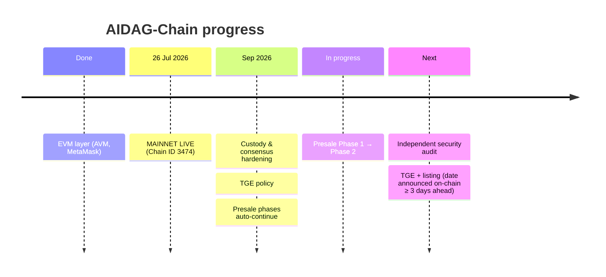
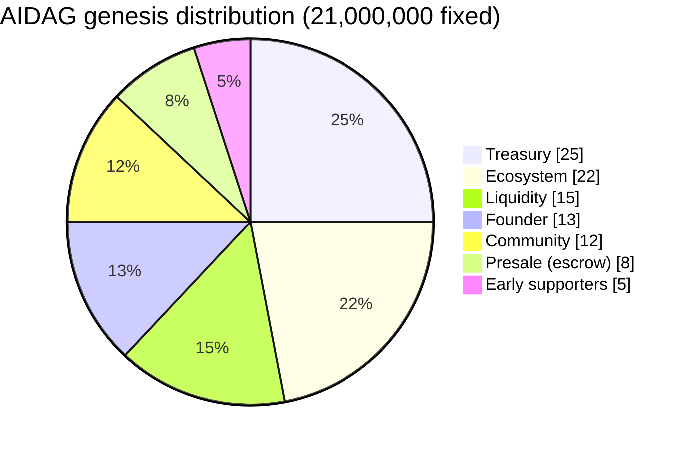

# AIDAG-Chain

**A Rust Layer-1 with DAG consensus and an EVM-compatible execution layer — engineered as infrastructure for verifiable digital records.**

> **Mainnet is live** since 26 July 2026 — network / Chain ID `3474`, pinned genesis `b82345008ae109d8`.
> Explorer, wallet dApp, presale and whitepaper: **[aidag-chain.com](https://aidag-chain.com)**

---

## What it is

AIDAG-Chain is a DAG-based Layer-1 blockchain. Blocks are **vertices** in a directed acyclic graph, ordered by **GHOSTDAG** consensus for parallel block production without a single-chain bottleneck. The execution layer is **EVM-compatible** (built on `revm`), so MetaMask, ethers.js and Solidity contracts work against it out of the box.

*Figure 1 — Every vertex may reference several parents; the newest unreferenced vertices are the **tips**. GHOSTDAG turns this parallel graph into one deterministic total order, so honest parallel work is kept instead of discarded as forks.*

---

## Architecture

*Figure 2 — Applications speak standard Ethereum JSON-RPC. Execution combines an EVM-compatible machine with native registries. **All state is derived deterministically from the consensus order** — every node that sees the same vertices reaches the same state.*

| Component | Description |
|---|---|
| `lsc-engine/` | Rust core — GHOSTDAG consensus, AVM (`revm` execution), registries, genesis, transaction model |
| `lsc-net/` | Node binary, Ethereum-compatible JSON-RPC server (`eth_*`), libp2p networking |
| `soulware-core/` | KUBRA — the network's AI assistant (grounded answers, on-chain document verification, answers fingerprinted on-chain) |
| Front-end | Next.js block explorer, wallet dApp, presale and whitepaper |

---

## Progress

*Figure 3 — Where we are. Mainnet is live; the presale is running; the independent audit and the TGE + listing are still ahead.*

| Step | Status |
|---|---|
| EVM layer (AVM, MetaMask transfers) | ✅ done |
| **Mainnet** — 26 Jul 2026, Chain ID 3474 | ✅ **live** |
| Custody & consensus hardening (Sep 2026) | ✅ done |
| Presale — Phase 1 → Phase 2 automatic | 🟡 in progress |
| Independent security audit | ⏳ pending |
| TGE + listing | ⏳ pending — announced on-chain ≥ 3 days ahead |
| Independent node operators | ⏳ roadmap |

**Network:** Mainnet is live and currently runs on nodes operated by the core team. Multi-node consensus has been tested with a remote node over the public internet. Onboarding independent node operators is on the roadmap.

---

## What's new — 22 Sep 2026

- 🛡️ **Custody hardening** — the daily presale cap and the TGE rules follow the *chain clock* (the highest timestamp in consensus order), so back-dated vertices cannot bypass them. Reorg recompute and fresh-node start fixed.
- ⏱️ **TGE policy** — the TGE date is open; it is set only after the presale completes and a listing decision is made, announced on-chain at least 3 days ahead, and final once reached.
- 📈 **Presale phases** — Phase 1 (630,000) → Phase 2 Reserve (1,050,000) continues automatically. On-chain total cap 1,680,000.
- 🔒 **Mainnet test endpoints closed** — faucet and test-mint endpoints refuse on every mainnet node (fixed 21,000,000 supply).
- 🤖 **KUBRA** — answers AIDAG questions from verified official documents, verifies 64-hex document hashes on-chain, and says "no verified information" instead of guessing.

**Determinism, proven:** before every consensus change, the real mainnet history is replayed with the old and the new code; the resulting state (allocations, TGE, balances, nonces) must match exactly — see `lsc-net/tests/mainnet_replay_ozet.rs`.

---

## Two assets

*Figure 4 — The seven genesis slices are fixed in the mainnet genesis and can never exceed 21,000,000 in total.*

- **AIDAG** — value asset, fixed 21,000,000 (18 decimals), sealed at genesis, no mining, no mint.
- **LSC** — gas asset (2,100,000,000); charged per transaction and split **50% burn / 50% development pool**.

---

## Try it

1. **Add the network to MetaMask** — RPC `https://aidag-chain.com/rpc`, Chain ID `3474`, symbol `AIDAG`, 18 decimals.
2. **Browse** live vertices and transactions at `aidag-chain.com/scan`.
3. **Verify a document** at `aidag-chain.com/belge` (pilot) — only the fingerprint goes on-chain.

## Stack

Rust · `revm` · GHOSTDAG · libp2p · ed25519 / secp256k1 · blake3 · Next.js / TypeScript / React · Python · Linux (systemd, pm2)

## Status

Mainnet live (network_id 3474, pinned genesis). Mainnet is live and currently runs on nodes operated by the core team. Multi-node consensus has been tested with a remote node over the public internet. Onboarding independent node operators is on the roadmap. Independent security audit: **pending** — until it completes, treat all components as pre-audit.

Remote-node test procedure and logs: [`UZAK_DUGUM_TESTI.md`](UZAK_DUGUM_TESTI.md) · test suite: [`TESTLER.md`](TESTLER.md).

## Links

- **Explorer, dApp, presale & whitepaper:** https://aidag-chain.com
- **Repository:** https://github.com/DeepSea3474/aidag-chain-engine
- **X:** https://x.com/AidagChain_
